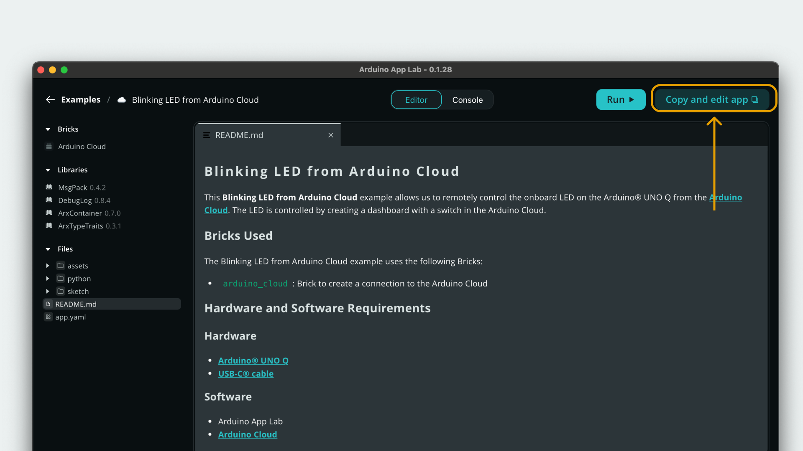

In the previous tutorial, we learned a little bit about how Apps work, and that they are a combination of Arduino sketches and Python scripts. But there's a lot more to it. In this tutorial, we will learn a bit more about how we can create our own Apps, using pre-made code called **Bricks**.

## How does an App Work?

Apps are launched as a package on our board, and only one App can run at the same time. Apps consist of two major parts:
- **Python** - an application written in Python that runs on the Linux OS.
- **Sketch** - a sketch written in the Arduino language (C++) that runs on the microcontroller.

In particular, the following files are considered the "core" files of an App.
- A `python/main.py` - for writing code that will run on the Linux side.
- A `sketch/sketch.ino` - for writing code that will run on the microcontroller side.
- An `app.yaml` - configuration file for the App (managed by App Lab and tooling, and may be updated by API calls).
- A `sketch.yaml` - sketch-side configuration file (managed by App Lab and tooling, and may be updated by API calls).

> **Note:** the `python/` and `sketch/` folders are expected by convention. Renaming or removing them may prevent the App from running (for example missing entry points like `main.py` or `sketch.ino`).  
> The `assets/` folder is optional and depends on the Bricks used (for example WebUI). It is not part of the standard App definition and can be omitted or overridden at Brick level.


The **Python part** of the application is capable of running AI models, hosting a web server, or making calls to external services.

The **sketch part** of the application handles interaction with sensors, LEDs, motors, and other electrical components.

The two parts can communicate with each other through something called **Bridge**.

### Bridge

**Bridge** is a tool that enables communication between the Linux system and the microcontroller. It allows data to be exchanged between the two systems seamlessly.

This communication works through a **provide and call** mechanism, where one system can *provide* data and the other can *request* (or call) that data when needed. 


Bridge is an essential tool that is used in any application that requires the two systems to communicate.

> On the Python side, Bridge is imported in the `main.py` file through `from arduino.app_utils import Bridge`

> On the Sketch side, `Arduino_RouterBridge.h` is imported in the `sketch.ino` file.

### App.run()

The `App.run()` function must be used in **all Apps**, at the bottom of the `main.py` file, in order to properly launch the App.

This function does the following:
- Launches all Bricks included in the App.
- Keeps the App running until it is stopped, which makes any method defined to be called via Bridge remain available.

The App can also run a **user-defined loop**, using the `user_loop` parameter that receives a function name to be looped:

```python
def loop():
    global led_state
    time.sleep(1)
    led_state = not led_state
    Bridge.call("set_led_state", led_state)

App.run(user_loop=loop)
```

- The `loop` function is created, with a specific set of instructions.
- `App.run(user_loop=loop)` will keep looping the `loop` function over and over. 

>**Important Note:** always place the `App.run()` at the very bottom of the `main.py` script, as any code added after will be ignored.

This is used in the [example provided](/learn/apps#understand-the-code-the-blink-example) further down in this tutorial.

## Create a New App

To create an App, navigate to the **"My Apps"** section, available through the menu on the left.

Click on the **"Create New App"**, and complete the setup wizard. We will receive an empty template containing the necessary files to start building.


After creating an App, it will be available under **"My Apps"**. To edit the App, we just need to click into it, and select a file from the **File Manager** to the left.


### Duplicating Existing Example

Built-in examples cannot be edited, but if we want to start from an **existing example**, we can duplicate it.

1. Navigate to the [Examples](/examples) tab and select an example.
2. In the top-right, next to the Run button, click **"Copy and Edit App"**.
   
3. Name the App, and click on **"Create New"**.
4. We will be redirected into a new App project, which is fully editable.

## Launching an App

When we launch an App, two essential things happen:

1. The `sketch.ino` file is compiled on the board itself (on the Linux system), and is then uploaded to the microcontroller.
2. The `main.py` launches on the Linux system.

These two parts can be monitored through the "Console" tab.

### Accessing App Logs

To access the App logs, we can navigate to the **"Console"** tab of an App that is running.

By default, when launching an App, the **start-up logs** are visible. We can also view the **Python** and **sketch** logs.


### Accessing Python Logs

The Python logs are accessible under the **"main"**. Here we can see the status of the Python application (`main.py`). Using the `print()` command inside the Python script will be visible here.

### Accessing Sketch Serial Data

Serial communication from the sketch (MCU) can also be accessed in the **"Sketch"** tab. 

To print the data, we use `Monitor.print()` in the sketch. For example:

```arduino
Monitor.print("Data: ");
Monitor.println(data);
```

Will appear in the console as `Data: <value>`.

## Accessing a Running App (Web UI)

Many Apps are created with a web interface, which we can access by opening a browser on the same network. For example, if we run an App that records temperature and hosts a web server, we can access it by:
- Opening a browser on the device itself (this requires us to have a screen, keyboard & mouse connected).
- Connecting to the board's local IP, from a device on the same network.

>The deployed web server can by default be accessed at `http://localhost:7000` in the browser. If connecting via another device, the address is: `http://<board-hostname>.local:7000`.


## Understand the Code: The Blink Example

Let's take a look at one of the simpler examples, such as the classic **blink** example. The example demonstrates how the Linux system controls the microcontroller's built-in LED, using the **Bridge** tool.

### The Python Side

Below is the code for the Python side of our App, which uses the `App` and `Bridge` tools.

```python
from arduino.app_utils import App, Bridge
import time

led_state = False

def loop():
    global led_state
    time.sleep(1)
    led_state = not led_state
    Bridge.call("set_led_state", led_state)

App.run(user_loop=loop)
```

- The `loop` function is declared with the logic of switching the `led_state` variable.
- A call to the microcontroller is made via the `Bridge.call("set_led_state", led_state)` function.
- `App.run(user_loop=loop)` will start the App, and make the `loop` function *loop* forever.

### The Sketch Side

Below is the code for the microcontroller (Arduino/C++), which uses the `Arduino_RouterBridge` library to communicate with the Python side.

```cpp
#include "Arduino_RouterBridge.h"

void set_led_state(bool state);

void setup() {
    pinMode(LED_BUILTIN, OUTPUT);

    Bridge.begin();
    Bridge.provide("set_led_state", set_led_state);
}

void loop() {
}

void set_led_state(bool state) {
    // LOW state means LED is ON
    digitalWrite(LED_BUILTIN, state ? LOW : HIGH);
}
```

On the sketch side, the `Bridge.provide("set_led_state", set_led_state)` receives the updated state and calls the `set_led_state()` function:

```arduino
void set_led_state(bool state) {
    // LOW state means LED is ON
    digitalWrite(LED_BUILTIN, state ? LOW : HIGH);
}
```

Every time it receives an update (which is every second), the LED will switch ON / OFF

> The **Bridge** utility makes it possible for a Python application and a sketch to communicate. This is handled via the `bridge` utility on the Python side, and the `Arduino_RouterBridge` library on the sketch side. They use a technique called Remote Call Procedure (RPC).

## Next Steps

In this tutorial, we have learned about Apps:
- How they are structured
- How to create a new App
- How the code looks like for the Linux system and the microcontroller
- How the `App.run()` works, and how it is a key function in the `main.py` script
- How the Linux system interacts with the microcontroller using the `Bridge` utility

In the next tutorial, we will dive into **Bricks**, and how we can use them in our Apps.